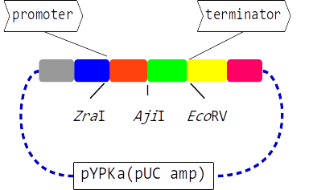

# Yeast pathway kit promoter and terminator vectors

This repository contain [pYPKa](sequences/pYPKa.gb) plasmids with a
total of 66 promoter and 66 terminators (2022-05-02)
in a total of 66 + 66 = 132 vectors.

Promoters and terminator are DNA fragments representing intergenic sequences from _S. cerevisiae_ tandemly
expressed genes, so the same DNA fragment can function as both a promoter and a terminator.

Fragments to be used as promoters are cloned in the [ZraI](http://rebase.neb.com/rebase/enz/ZraI.html) restriction site
while fragments to be used as terminators are cloned in [EcoRV](http://rebase.neb.com/rebase/enz/EcoRV.html).

Plasmids with an insert in ZraI are named **pYPKa_Z_*.gb** and plasmids with an insert in EcoRV are named  **pYPKa_E_*.gb**.

The sequences were assembled programmatically using [pydna](https://bmcbioinformatics.biomedcentral.com/articles/10.1186/s12859-015-0544-x).

The python file `plasmid_script.py` contains a script that assembles plasmids
using data in a set of csv files:

- [promoter_list_001.csv](sequences/promoter_list_001.csv)
- [promoter_list_002.csv](sequences/promoter_list_002.csv)
- [promoter_list_003.csv](sequences/promoter_list_003.csv)